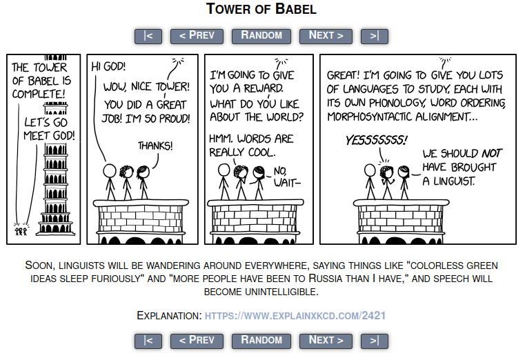

# XKCDo
Helping non-physicists understand Randall Munroe's humor.

## Contents

* A content script, `epxlain.js`, that is injected into any pages under xkcd.com
 It adds:
  - The title text of the comic image below it because you don't want to move your cursor like a sucker
  - A link to explainxkcd.com because you don't really understand what Randall means
* A `manifest.json` which tells browsers what this is
* This README
* A kick-ass icon

## Changelog

### `[v0.0.1]`
#### Added
 - Display alt text under image
 - Display link to explainxkcd.com under image
